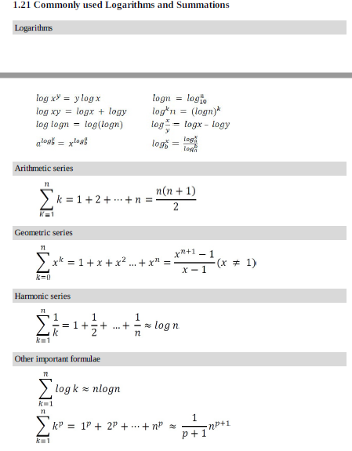

Time Complexity Analysis
-
There are two types of algorithms.   
 - Iterative   
	- Time complexity is determined by number of iterations  
 - Recursive   
	- Time complexity is calculated by number of recursive function invocations  
 - Neither iterative nor recursive  
	- Time complexity is not dependent on input size and is constant  
		
	<i>Note</i>: Any function that is written using iterative algorithm can be written using recursive algorithm and vice-versa. 

General Rules
-
1. <ins>Loops</ins>: The running time of a loop is, at most, the running time of the statements inside the loop (including tests) multiplied by the number of iterations.  

		//executes n times
		for (i=1; i<=n; i++)    
		m = m+2; //constant time, c   
		
Total time = c * n = cn = O(n)  
2. <ins>Nested loops</ins>: Analyze from the inside out. Total running time is the product of the sizes of all the loops.  

		//outer loop executed n times  
		for (i=1; i<=n; i++){  
		//inner loop executes n times  
		for (j=1; j<=n; j++)  
		k = k+1; //constant time  
		}  
		
Total time = c * n * n = cn2 = O(n2)  
3. <ins>Consecutive statements</ins>: Add the time complexities of each statement

		x = x + 1; // constant time c0  
		//executes n times  
		for (i=1; i <= n; i++) {   
			m = m+2; // constant time c1  
		}  
		//outer loop executed n times    
		for (i=1; i<=n; i++){   
			//inner loop executes n times   
			for (j=1; j<=n; j++) {  
				k = k+1; //constant time c2   
		}  
				
Total time = c0 + c1n + c2n2 = O(n2).  
4. <ins>If-else statements</ins>: Worst-case running time: the test, plus either the if part or the else part (whichever is the larger).  

		if(length () == 0) {  //c0
			 return false; //c1
		}  
		else {
			for (i=0; i < n; i++) {  //n times
				if (!list[n].equals(xxxxxx)){ //c2
					return false; //c3
				}
			}
		}
		
Total time = c0 + c1 + (c2 + c3) * n = O(n).  
5. <ins>Logarithmic complexity</ins>: An algorithm is O(logn) if it takes a constant time to cut the problem size by a fraction (usually by ½). 

		for (i=1; i<=n; i = i * 2){
			//code
		}    
		
		while(i <= n){
			i = i * 2;
			//code
		}	

			value of i is doubling every time. Assume loop is executing k times. At kth step 2k = n, and at (k + 1)th step we come out of the loop. Taking logarithm on both sides, gives total time = O(logn).
			
log(2k) = log(n);
k log2(2) = log(n);
k = log(n);

<b>Common Equations</b>

Amortized Analysis
-
	- Amortized analysis refers to determining the time-averaged running time for a sequence of operations.  
	- Amortized analysis generally applies to a method that consists of a sequence of operations, where the vast majority of the operations are cheap, but some of the operations are expensive.
	- When one event in a sequence affects the cost of later events:
	• One particular task may be expensive.
	• But it may leave data structure in a state that the next few operations become easier.
	
	<i>Example</i>
	Let us consider an array of elements from which we want to find the kth smallest element. We can solve this problem using sorting. After sorting the given array, we just need to return the kth element from it. The cost of performing the sort (assuming comparison based sorting algorithm) is O(nlogn). If we perform n such selections then the average cost of each selection is O(nlogn/n) = O(logn). This clearly indicates that sorting once is reducing the complexity of subsequent operations.

------------------------
Iterative algorithms examples
-----------------------------

Problem 1
---------
	int i=1;
	int s=1;
	while(s <= n){
		i++;
		s= s+i;
	}

To findout howmany times the while gets executed given n as input , let us observe the values of i and s for few iterations.

	i --> 1	 2	3	4	5	6 
	s --> 1  3	6	10	15	21 .... n

The value of s at kth iteration is sum of integers from 1 to k. i.e. at 2nd iteration s value is sum of 1,2 and 3rd iteration it is sum of 1,2,3. The value of s at kth iteration is k(k+1)/2.

Suppose if the condition s <= n, is met at kth iteration.i.e. 
	k(k+1)/2 <= n;
	(k^2+k)/2 <= n;
	k^2 <= n; (ignore lower order terms)
It means k is proportional to √n. 

Answer
------
The time complexity of the above problem is O(√n).

Problem 2
---------
	for(int i=1; i^2 < n;i++){}

Instead of writing i^2 < n, we can write i < √n .i.e. time complexity O(√n).

Note:In the above problem , The best , worst and average cases are same, so we can write θ(√n).
	
Answer
------
The time complexity of the above problem is θ(√n).

Problem 3
---------
	int i,j,k,n;
	for(int i=1; i<= n; i++){
		for(int j=1; j<=i; j++){
			for(int k=1; k<= 100; k++){
				System.out.println("k" + k);
			}
		}
	}

Time taken for innermost for loop is not dependent on input size n. It takes constant time.
Lets observe the values of i,j,k with input size n.

i -->	1	2	3	4	...n
j -->	1	2	3	4	...n
k -->	100	200	300	400	...n*100

Total time for executing n iterations is (100+200+300+400 ...+n*100) = 100n(n+1)/2.

Answer
------
The time complexity of the problem is O(n*n).

Problem 4
---------
	int i,j,k,n;
	for(int i=1; i<= n; i++){
		for(int j=1; j<=i*i; j++){
			for(int k=1; k<= n/2; k++){
				System.out.println("k" + k);
			}
		}
	}

Lets observe the values of i,j,k with input size n.

i -->	1	2		3		4		...n
j -->	1	4		9		16		...n
k -->	n/2	4n/2		9n/2		16n/26		...(n^2*n)/2

Total time complexity for an input size of n is 
	n/2 + 4n/2 + 9n/2 ....(n^2)*n/2 = n/2(1+2*2+3*3+ ...n*n) = (n/2)*(n)(n+1)(2n+1)/6

Answer
------	
The time complexity of the problem is O(n*n*n*n).i.e. n power 4.

Problem 5
---------
	for(int i=1;i<n;i=i*2){
		//logic
	}
L
lets observe i value for an input size n

i --> 1	 	2	 4	 8 		...n
	  2^0	2^1	 2^2 2^3	...2^k

If i takes k iterations to reach value of n, then 2^k = n. i.e. k = log2(n)

Answer:
-------
The time complexity of the problem is O(log2(n))

Note: if i value is incremented as i*3, then time complexity is log3(n). depending on the order of increase of i, base of the log function changes.

Problem 6
---------
	int i,j,k,n;
	for(int i=n/2; i<= n; i++){ //n/2 times
		for(int j=1; j<=n/2; j++){ // n/2 times
			for(int k=1; k<= n; k=k*2){ //logn times
				System.out.println("k" + k);
			}
		}
	}

The outer for loop executes from n/2 to n. i.e. n/2 times. The middle for loop executes from 1 to n/2. i.e. n/2 times. The innermost for loop executes log2(n). 

Total time complexity is : (n/2)(n/2)log2(n)

Answer:
-------
The time complexity of the problem is O(n*n*log2(n))

Problem 7
---------
	int i,j,k,n;
	for(int i=n/2; i<= n; i++){ //n/2 times
		for(int j=1; j<=n; j=2*j){ // log2(n) times
			for(int k=1; k<= n; k=k*2){ //log2(n) times
				System.out.println("k" + k);
			}
		}
	}

Total time complexity is : (n/2)(log2(n))(log2(n))

Answer:
-------
The time complexity of the problem is O(n(log2(n))(log2(n)))

Note: To achieve the log(n) complexity using for loop(or while loop) in reverse order it the code should be like this.
	
	for(int i=n; i>1 ; i=n/2){}
	
	while(n>1){
		n=n/2
	}

The above two loops also have time complexity of log2(n)

Problem 8
---------
	
	for(int i=1; i<= n; i++){ 
		for(int j=1; j<=n; j=j+i){ 
			
		}
	}

The inner loop depends on outer loop for increment. Lets unroll this.

i --> 1		2		3		...n
j --> n		n/2		n/3		...1

Note: Inner for loop increments with the value of i. It means every iteration of inner for loop executes n/i times.

Time complexity is n(1+1/2+1/3...+1/n) = nlogn

Answer:
-------
The time complexity of the problem is O(nlogn)

Problem 9
---------
	int n=2^2^k;
	for(int i=1; i<= n; i++){ 
		j=2;
		while(j<=n){
			j=j^2;
		}
	}

Outer for loop executes n times given an input size n. As n value depends on k, lets see how k value impacts while loop.

k --> 1			2			3				
n --> 4			16			256
j --> (2,4)		(2,4,16)	(2,4,16,256)	
Total n*2		n*3			n*4 

So, for a given k value Total no of iterations of while loop is (k+1). Outer for loop executes n times. so total time is n*(k+1).

To find the total time with the input size n, we need to convert k value to n. i.e. 
	n=2^2^k;
applying logarithm on both sides	
	logn = 2^k;
again applying logarithm,
	log(logn) = k;

Answer:
-------
The time complexity of the problem is O(nlog(logn))

