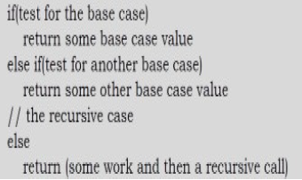

Recursion and Backtracking
- 
<h3>Recursion</h3>

 - Any function which calls itself is called recursive.
 - A recursive method solves a problem by calling a copy of itself to work on a smaller problem. This is called the recursion step
 - It is important to ensure that the recursion terminates.
 - Recursion is most useful for tasks that can be defined in terms of similar subtasks. (<i>Eg</i> : Sort, search)
 - <ins><b>Format of Recursive Function</b></ins>  
    - The case where the function calls itself to perform sub-task is called <i><b>recursive case</b></i>  
	- The case where the function encounters a sub-task that it can perform without calling itself is called <i><b>base case</b></i>  

 - <i>Example</i>
	n! is the product of all integers between n and 1. Definition of n! is :
	
		n! = 1, if n = 0  
		n! = n * (n-1)!, if n > 0  
		
Sample Code for factorial
		
		static int factorial(int number) {
			if (number == 0 ) { 
				return 1;
			} else {
				return number * factorial(number-1);
			}
		}	
		
 - <ins><b>Recursion Memory Visualization</b></ins>  
	- The recursive solutions look simple but visualization and tracing takes time

 - <ins><b>Recursion Versus Iteration</b></ins>  
   - <b>Recursion</b>
	 - Terminates when a base case is reached.
	 - Each recursive call requires extra space on the stack frame (memory).
	 - If we get infinite recursion, the program may run out of memory and result in stack overflow.
	 - Solutions to some problems are easier to formulate recursively.
   - <b>Iteration</b>
	 - Terminates when a condition is proven to be false.
	 - Each iteration does not require extra space.
	 - An infinite loop could loop forever since there is no extra memory being created.
	 - Iterative solutions to a problem may not always be as obvious as a recursive solution.
	
<h3>Divide and Conquer</h3>

 A divide-and-conquer algorithm is recursively breaking down a problem into two or more sub-problems of the same or related type, until these become simple enough to be solved directly.

 The strategy is :

		dac(p){
			if(small(p)){
				solution(p)
			} else {
				divide p into p1,p2,p3.....pk
				apply dac(p1),dac(p2)....dac(pk)
				combine(dac(p1),dac(p2),...dac(pk))
			}
		}

 Common problems that can be solved using Divide and Conquer approach are 
 	- Binary Search  
	- Find max and min  
	- Merge Sort  
	- Quick Sort  
	- Strassen's matrix multiplication  

 <b>Recurrence Relation</b>  
 	- Equation thats's used to define time complexity of recursive functions.   
	- Expressed as a set of values defined, with one or more initial terms given, and further terms defined as a function of the preceding terms <i>Eg.,</i>T(n)=T(n-1)+n
 
 <h4>Recurrence Relation for Decreasing functions</h4>

 <b>Problem 1</b>

		void test(n){
			if( n > 0) { // constant time c0
				System.out.println(n); // constant time c1
				test(n-1); // T(n-1)
			}
		}

 T(n) = T(n-1) + (c0 + c1) 
 <b>T(n) = T(n-1) + 1 </b><i>// Using asymptotic notation, c0 + c1 can be represented as 1.</i>

<b>Time complexity calculation</b>  
 Terminating condition is n > 0, means when n = 0, T(n) = 1.

		T(n) =  1 			when n = 0
		T(n) = T(n-1) + 1 	when n > 0
		
 Solution:
		
		T(n) = T(n-1) + 1
		T(n) = T(n-2) + 2 <i>// by substituting T(n-1) = T(n-2) + 1</i>
		T(n) = T(n-3) + 3 <i>// by substituting T(n-2) = T(n-3) + 1</i>
		....
		T(n) = T(n-k) + k

		T(n) = T(n-n) + n <i>// when k = n</i>

 Hence, time complexity of the problem is <b>O(n)</b>.

 <b>Problem 2</b>

		void test(n){
			if( n > 0) { // constant time c0
				for(int i = 0; i < n ; i++){ // n times
					System.out.println(n); // constant time c1 * n
				}
				test(n-1); // T(n-1)
			}
		}

 T(n) = T(n-1) + n + c1n + c0 
 T(n) = T(n-1) + (1 + c1)n + c1

 <b>T(n) = T(n-1) + n </b> <i>// using asympotatic notation (1 + c1)n + c0 becomes n.</i>

<b>Time complexity calculation</b>  
 Terminating condition is n > 0, it means when n = 0, T(n) = 1. 

		T(n) =  1 			when n = 0
		T(n) = T(n-1) + n 	when n > 0
		
 Solution:
		
		T(n) = T(n-1) + n
		T(n) = T(n-2) + (n-1) + n  //by substituting T(n-1) = T(n-2) + (n-1)
		T(n) = T(n-3) + (n-2) + (n-1) + n  //by substituting T(n-2) = T(n-3) + (n-2)
		....
		T(n) = T(n-k) + (n-k+1) + (n-k+2) + ....(n-2) + (n-1) + n

		T(n) = T(n-n) + 1 + 2 + 3 + ..... + (n-2) + (n-1) + n // when k = n
		
		T(n) = n(n+1)/2

 So, time complexity of the problem is <b>O(n2)</b>.

 <b>Problem 3</b>

		void test(n){
			if( n > 0) { // constant time c0
				for(int i = 0; i < n ; i*2){ // log(n) times
					System.out.println(n); // constant time c1 * log(n)
				}
				test(n-1); // T(n-1)
			}
		}

 T(n) = T(n-1) + log(n) + c1log(n) + c0
 T(n) = T(n-1) + (c0 + c1)log(n) + c0

 <b>T(n) = T(n-1) + log(n)</b> <i>// Using asympotatic notation (c0 + c1)log(n) + c0 becomes log(n).</i>

 <b>Time complexity calculation</b>   
 Terminating condition is n > 0, it means when n = 0, T(n) = 1.

		T(n) =  1 				when n = 0
		T(n) = T(n-1) + log(n) 	when n > 0
		
 Solution:
		
		T(n) = T(n-1) + log(n)
		T(n) = T(n-2) + log(n-1) + log(n) // by substituting T(n-1) = T(n-2) + log(n-1)
		T(n) = T(n-3) + log(n-2) + log(n-1) + log(n) // by substituting T(n-2) = T(n-3) + log(n-2)
		....
		T(n) = T(n-k) + log(n-k+1) + log(n-k+2) + ....log(n-3) + log(n-2) + log(n-1) + log(n)
		T(n) = T(n-n) + log(1) + log(2) + log(3)....log(n-3) + log(n-2) + log(n-1) + log(n) // when k = n
		
		T(n) = 1 + log(1*2*3*...n) // using the formula log(a) + log(b) = log(ab)
		T(n) = 1 + log(n!) // The next higher order term of n! is nn
		T(n) = 1 + nlog(n)
		

 Hence, time complexity of the problem is <b>O(nlog(n))</b>.
		
 <b>Problem 4</b>
		
		void test(n){
			if( n > 0) { // constant time c0
				System.out.println(n); // constant time c1 * log(n)
				test(n-1); // T(n-1)
				test(n-1); // T(n-1)
			}
		}

 T(n) = 2T(n-1) + c1 + c0

 <b>T(n) = 2T(n-1) + 1</b> <i>// Assympotatic notation for the above c1 + c0 becomes 1.</i>

 <b>Time complexity calculation</b>   
 Terminating condition is n > 0, it means when n = 0, T(n) = 1.

		T(n) =  1 					when n = 0
		T(n) = 2T(n-1) + log(n) 	when n > 0
		
 Solution:
		
		T(n) = 2T(n-1) + 1
		T(n) = 2^2T(n-2) + 2 + 1 // by substituting T(n-1) = 2T(n-2) + log(n-1)
		T(n) = 2^3T(n-3) + 2^2 + 2 + 1 // by substituting T(n-2) = 2T(n-3) + log(n-2)
		....
		T(n) = 2^kT(n-k) + 2^(k-1) + 2^(k-2) + ....2^3 + 2^2 + 2^1 + 2^0
		T(n) = 2^n + 2^(n-1) + 2^(n-2) + ....2^3 + 2^2 + 2^1 + 2^0  // when k = n
		
		T(n) = 2^(n+1)-1 // using the formula a + ar^2 + ar^3 + ...ar^n-1 = a(r^n-1)/(r-1) where r = 2 and a =1 

 Hence, time complexity of the problem is <b>O(2n).</b>

<h4>Deriving masters theorm from the above solved problems</h4>

		T(n) = T(n-1) + 1		->	O(n)
		T(n) = T(n-1) + n		->	O(n^2)
		T(n) = T(n-1) + log(n)	->	O(nlog(n))
		T(n) = 2T(n-1)+ 1		-> 	O(2^n)
		T(n) = 3T(n-1)+ 1		-> 	O(3^n)	
		T(n) = 2T(n-1)+ n		-> 	O(n2^n) 
  
  Using the same logic as above, if 1 is replaced by another number, following would be the time complexity
		
		T(n) = T(n-2) + 1	->	n/2 (decrease by 2 means n/2) ≈ O(n)
		T(n) = T(n-100) + 1	->	n/100 ≈ O(n)
		T(n) = T(n-k) + 1 	->  n/k ≈ O(n) (at larger values of n, n/k ≈ n)
	
 <ins><h3>Masters theorm for decreasing functions</h3>  </ins>

 If T(n) = aT(n-b) + f(n)  
 - where a > 0, b > 0 and  
 - f(n) = O(nk) where k > 0,  
 - then time complexity  
   - O(nk+1) if a = 1 
   - O(annk) if a > 1 
   - O(nk) if a < 1 

Recurrence Relation for Dividing functions
---------------------------------------------
<b>Problem 1</b>

		test(n){
			if(n > 1) { //c0 
				System.out.println(n); // c1
				test(n/2); // n/2 times
			}
		}

T(n) = T(n/2) + (c0 + c1)
 
<b>T(n) = T(n/2) + 1 </b> 

<b>Time complexity calculation</b>  

Terminating condition for algorithm is n > 1, it means when n = 1, T(n) = 1.

		T(n) =  1 			when n = 1
		T(n) = T(n/2) + 1 	when n > 1
		
Solution:
		
		T(n) = T(n/2) + 1
		T(n) = T(n/2^2) + 2 // by substituting T(n) = T(n/2) + 1
		T(n) = T(n/2^3) + 3 // by substituting T(n/2) = T(n/2^2) + 1
		....
		T(n) = T(n/2^k) + k

For the above equation to terminate, n/2^k = 1 i.e. when k = log2n.

		T(n) = T(1) + log(n) // when n = 2^k

So, time complexity of the problem is O(log(n)).

<b>Problem 2</b>

		test(n){
			if(n > 1) { //c0 
				
				for(int i = 0; i < n ; i++) {
					System.out.println(n); // c1
				}
				test(n/2); // n/2 times
			}
		}

T(n) = T(n/2) + (c0 + c1*n) 

<b>T(n) = T(n/2) + n </b> 

<b>Time complexity calculation</b>  

Terminating condition for algorithm is n > 1, it means when n = 1, T(n) = 1.

		T(n) =  1 			when n = 1
		T(n) = T(n/2) + n 	when n > 1
		
Solution:
		
		T(n) = T(n/2) + n
		T(n) = T(n/2^2) + n/2 + n // by substituting T(n) = T(n/2) + n
		T(n) = T(n/2^3) + n/2^2 + n/2 + n // by substituting T(n/2^2) = T(2/2^3) + (n/2^2)
		....
		T(n) = T(n/2^k) + n/2^k + n/2^(k-1) + ... + n/2^2 + n/2 + n

For the above equation to terminate, n/2^k = 1 or when k = log2n.

		T(n) = T(n/2^k) + n(1 + 1/2 + 1/2^2 + 1/2^3 + ...+1/2^k) 
		T(n) = T(1) + n(1 + 1/2 + 1/2^2 + 1/2^3 + ...+1/n) // substituting n = 2^k
		T(n) = 1 + n(1 + 1) //  1/2 + 1/2^2 + 1/2^3 + .... = 1 (circle partition logic)
		T(n) = 2n + 1
		
So, time complexity of the problem is O(n).

 <b>Problem 3</b>

		test(n){
			if(n > 1) { //c0 
				
				for(int i = 0; i < n ; i++) {
					System.out.println(n); // c1
				}
				test(n/2); // n/2 times
				test(n/2);
			}
		}

T(n) = 2T(n/2) + (c0 + c1*n) 

<b>T(n) = 2T(n/2) + n </b> 

<b>Time complexity calculation</b>  

Terminating condition for algorithm is n > 1, it means when n = 1, T(n) = 1.

		T(n) =  1 			when n = 1
		T(n) = 2T(n/2) + n 	when n > 1
		
Solution:
		
		T(n) = 2T(n/2) + n
		T(n) = 2^2T(n/2^2) + 2*n/2 + n = 2^2T(n/2^2) + 2n // by substituting T(n/2) = 2T(n/2) + n
		T(n) = 2^3T(n/2^3) + 2^2*n/2^2 + 2n = 2^3T(n/2^3) + 3n // by substituting T(n/2^2) = 2T(n/2^3) + n/2^2
		....
		T(n) = 2^kT(n/2^k) + k*n
		
For the above equation to terminate, n/2^k = 1 or when k = log2n.

		T(n) = nT(1) + nlog(n)) 
		T(n) = n + nlog(n)
		
So, time complexity of the problem is O(nlog(n)).

Masters theorm for dividing functions
-------------------------------------
If T(n) = aT(n/b) + f(n)  
 - where a >= 1, b > 1 and 
 - f(n) = O(nk (logn)p) where k > 0, then 
   - Case 1: If logba > k, then 
     - time complexity O(nlogba)
   - Case 2: If logba = k, then 
     - if p > -1 time complexity O(nk(logn)p+1)
     - if p = -1 time complexity O(nkloglog(n))
     - if p < -1 time complexity O(nk)
   - Case 3: if logba < k, then 
     - if p >=0 time complexity O(nk(logn)p)
     - if p <0 time complexity O(nk)
	
Case 1 examples
---------------
a)T(n) = 2T(n/2) + 1

a = 2, b = 2, k = 0 (1 can be written as n^0) , this belongs to case 1 because (log22 ) > 0 
	
Time complexity : O(nlog22)	= O(n)

b)T(n) = 4T(n/2) + 1

a = 4, b = 2, k = 0 (log24 > 0)

Time complexity : O(nlog24)	= O(n2)

c)T(n) = 8T(n/2) + 1

Time complexity : O(nlog28)	= O(n3)

d)T(n) = 8T(n/2) + n2

a = 8, b = 2, k = 2 , this belongs to case 1 because (log28  > 2) 

e)d)T(n) = 8T(n/2) + nlog2n

a = 8, b = 2, k = 1 , this belongs to case 1 because (log28  > 1) 

Time complexity : O(nlog28)	= O(n3)

Note: As long as log of a base b greater than k, it won't consider the log component of the second term.

Conclusion: If a base b of first term greater than power of n of second term, it belongs to case 1.

Case 2 examples
---------------

As we know In case 2, we have 3 subcases p > -1, p =-1 and p< -1. 

p > -1
------
a)T(n) = 2T(n/2) + n

a = 2, b = 2, k = 1 this belongs to case 2 because (log22 = 1). No log component in second term, so p is 0.

Time complexity is : O(nk(logn)p+1) = O(nlogn)

b)T(n) = 4T(n/2) + n2

a = 4, b = 2, k = 2 and p = 0

Time complexity is : O(n2logn)

c)T(n) = 4T(n/2) + n2logn

Time complexity is : O(n2log2n)

d)T(n) = 4T(n/2) + n2log2n

Time complexity is : O(n2log3n)

Conclusion: If a base b and k are equal then simply write n power k and increase log term power by 1.

p = -1
------
a)T(n) = 2T(n/2) + n/logn

a = 2, b = 2, k = 1 , p = -1

Time complexity is : O(nkloglogn) = O(nloglogn)

p < -1
-------
a)T(n) = 2T(n/2) + n/log2n

a = 2, b = 2, k = 1 , p = -2

Time complexity is : O(nk) = O(n)

Case 3
------
In case 3, we have two cases.

p >= 0
-----
a)T(n) = T(n/2) + n2

a = 2, b = 2, k = 2 , p = 0

Time complexity is : O(nk(logn)p) = O(n2)

b)T(n) = T(n/2) + n2logn

a = 2, b = 2, k = 2 , p = 1

Time complexity is : O(n2logn)

c)T(n) = T(n/2) + n2log2n

a = 2, b = 2, k = 2 , p = 2

Time complexity is : O(n2log2n)

p < 0
-----
a)T(n) = T(n/2) + n2/logn

a = 2, b = 2, k = 2 , p = -1

Time complexity is : O(nk) = O(n2)

Recurrence Relation for Root functions
--------------------------------------
 <b>Problem 1</b>

		test(n){
			if(n > 2) { //c0 
				System.out.println(n); // c1
				test(√n); // 
			}
		}

T(n) = T(√n) + (c0 + c1)
 
<b>T(n) = T(√n) + 1 </b>

<b>Time complexity calculation</b>  

Terminating condition for algorithm is n = 2. It means when n = 2, T(n) = 1.

		T(n) =  1 	when n = 2 (we consider T(√2) = 1)
		T(n) = T(√n) + 1 	when n > 2

Solution:
		
		T(n) = T(n^1/2) + 1
		T(n) = T(n^1/2^2) + 1 + 1 = T(n^1/2^2) + 2 
		T(n) = T(n^1/2^3) + 1 + 2 = T(n^1/2^3) + 3 
		....
		T(n) = T(n^1/2^k) + k

This will terminate when n1/2k becomes √2.  
&nbsp;&nbsp;		n1/2k = 21/2 
Applying log on both sides, 
&nbsp;&nbsp;		logn(1/2k) = 1/2(log22) 
&nbsp;&nbsp;		logn(1/2k) = 1/2 
&nbsp;&nbsp;		logn 2-k = 2 -1 
&nbsp;&nbsp;		logn = 2k-1 
Again applying log, 
&nbsp;&nbsp;		loglogn	= k-1 
&nbsp;&nbsp;		k = loglogn

so, time complexity is O(loglogn)		
		

		

