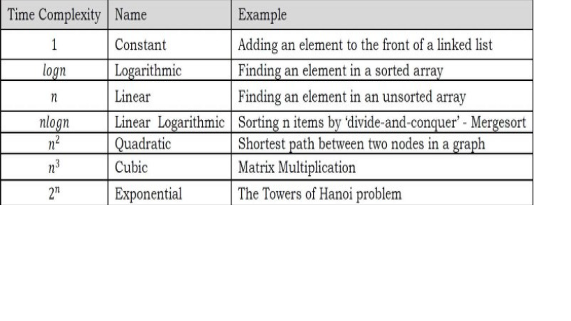

DATA STRUCTURES
-
- Particular way of storing and organizing data in a computer so that it can be used efficiently
- Facilitates access and modifications
- Types
    - Linear (accessed in sequential order, may or may not be stored in sequential memory locations)
      Eg: Linked Lists, Stacks, Queues, Arrays**
    - Non-Linear (Stored/accessed in non-linear order)
      Eg: Trees, Graphs

**Arrays cannot be created manually. They are created automatically by the programming language.

Abstract data types (ADT's)
- 
User-defined data types that are defined along with their operations
- Primitive data types support basic operations such as addition and subtraction. System provides implementations for these.
- For ADT the operations have to be defined explicitly.
- ADT describes certain operations that can be done on the data itself
- It is called "Abstract" because it gives an implementation-independent view
- Examples :: Data type and few operations
    - Stack
      -   isFull()
      -   isEmpty() 
    - Queue 
      - insert() 
      - delete()
    - List 
      - size() 
      - get(i)
- The user or client of the ADT needs to know about the method interfaces such as names of the methods, types of parameters and what are the values returned, not the actual implementation.

ALGORITHMS
- 
- An algorithm is the step-by-step unambiguous instructions to solve a given problem.
- Main Criteria to judge the merits of algorithm
    - Correctness (solution in finite number of steps)
    - Efficiency (limited resources to execute)
- <ins><b>Analysis of Algorithms</b></ins>
    - Amongst the various solutions possible, algorithm analysis helps determine the most efficient algorithm in terms of time and space consumed
    - Goal is to compare algorithms in terms of various factors (such as running time, memory, developer effort etc)
- <ins><b>Running Time Analysis</b></ins>
    - Process of determining how the running time increases as input size increases

<i>Note: Common types of input :: Size of array, Polynominal degree, Number of elements in a matrix, Vertices and indicies of the graph, Number of bits in input</i>

- <ins><b>Comparison of algorithms</b></ins>
    - Express running time of any algorithm as function of input size and compare them
    - Other comparison methods (not to be used)
        - Execution time : as these are specific to computer
        - Number of statements executed : as this is specific to the programming language

<a href="algorithms/1.analysis_of_algorithms.md">Next: analysis of algorithms</a>