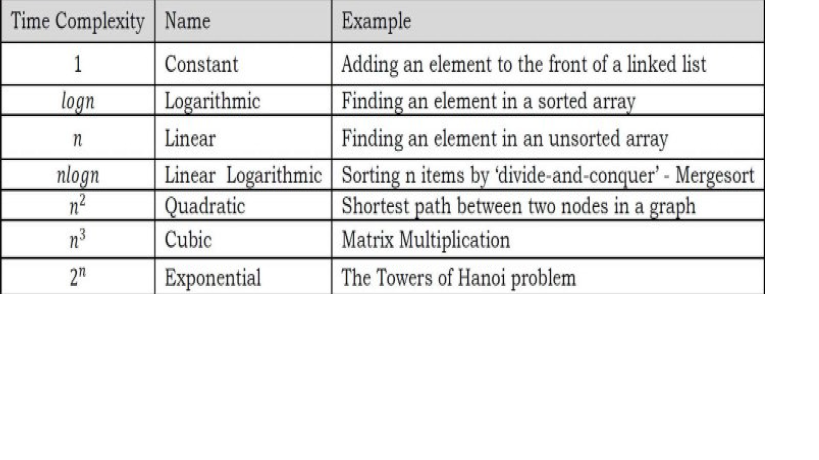
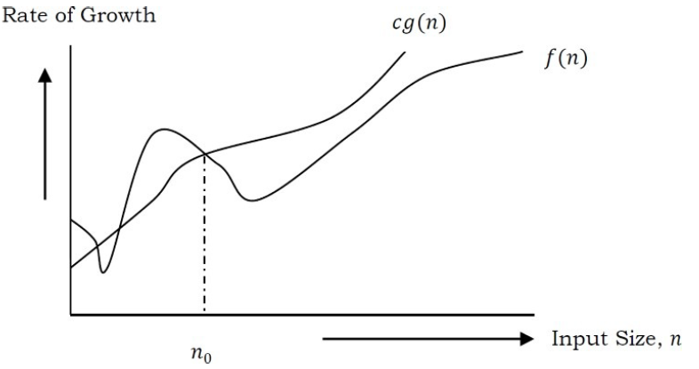
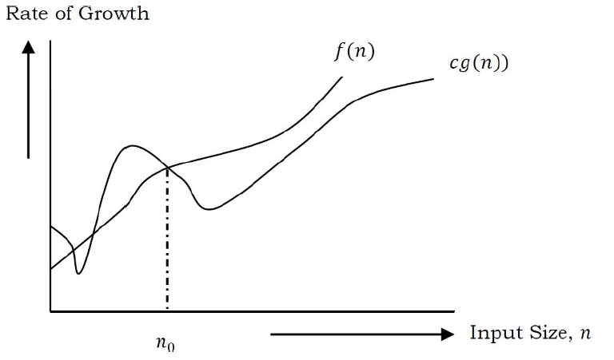
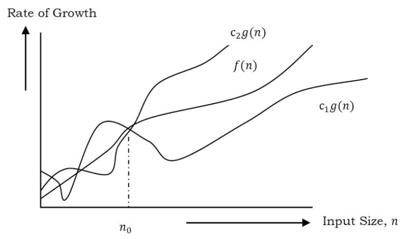

DATA STRUCTURES
-
 - Particular way of storing and organizing data in a computer so that it can be used efficiently
 - Facilitates access and modifications
 - Types
	- Linear (accessed in sequential order, may or may not be stored in sequential memory locations)
		Eg: Linked Lists, Stacks, Queues, Arrays**
	- Non-Linear (Stored/accessed in non-linear order)
		Eg: Trees, Graphs

**Arrays cannot be created in any programming language. Created automatically

Abstract data types (ADT's)
- 
User-defined data types that are defined along with their operations
- Primitive data types support basic operations such as addition and subtraction. System provides implementations for these.For ADT's the operations have to be defined 
- Describes certain operations that can be done on the data itself
- Called as "Abstract" since it gives an implementation-independent view
- Examples :: Data type and operations
	- Stack (isFull(), isEmpty() etc)
	- Queue (insert(), delete() etc)
	- List (size(), get(i) etc)
- The user or client of the ADT needs to know about the method interfaces (such as names of the methods, types of parameters, what methods  do and what are the values returned), not the actual implementation.

ALGORITHMS
- 
- An algorithm is the step-by-step unambiguous instructions to solve a given problem.
- Main Criteria to judge the merits of algorithm
	- Correctness (give solution in finite number of steps)
	- Efficiency (how much resources does it take to execute)
- <ins><b>Analysis of Algorithms</b></ins> 
	- Amongst the various solutions possible, algorithm analysis helps determine the most efficient algorithm in terms of time and space consumed
	- Goal is to compare algorithms in terms of various factors (such as running time, memory, developer effort etc)
- <ins><b>Running Time Analysis</b></ins>
	- Process of determining how the running time increases as input size increases 

<i>Note: Common types of input :: Size of array, Polynominal degree, Number of elements in a matrix, Vertices and indicies of the graph, Number of bits in input</i>

- <ins><b>Comparison of algorithms</b></ins>
	- Express running time of any algorithm as function of input size and compare them
	- Other comparison methods (not to be used)
		- Execution time : as these are specific to computer
		- Number of statements executed : as this is specific to the programming language
		

- <ins>Analysis of an algorithm</ins>
	- For which inputs algorithm takes least amount of time to run (Best case)
	- For which inputs algorithm takes longest amount of time to run (worst case)
	- For random inputs random running time of algorithm (Average case)
	<b>Lower Bound <= Average Time <= Upper Bound </b>
	
- <ins><b>Asymptotic Notation</b></ins>
	- Syntax for representing upper and lower bounds 
	- Upper and lower bounds need to be identified for best, worst and average cases
	- "Asymptotic" means approaching a value or curve arbitrarily closely 
	
	- <ins><b>Big O Notation (upper bound function)</ins></b>
		- If f(n) denotes the running time(time complexity) of an algorithm , then O(g(n)) = f(n), there exists positive constants c and n0 such that 0 <= f(n) <= cg(n), for all n >= n0.  
		
		<i> Example </i>  
		f(n) = 3n + 2  
		3n + 2 <= cn (This condition will be satisfied if c >= 4, we choose 4 because that is closest)  
		3n + 2 <= 4n  
		n >= 2  

		It means that the constant c is 4 and n0 is 2. i.e. The function 4n is always greater than 3n+2 when n >= 2. 

		<i>Conclusion</i> If f(n) = 3n +2 and g(n) = n, then f(n) = O(g(n)). It means that f(n) is always lessthan some constant multiplied by g(n), which is nothing but upper bound of f(n).
	- <ins><b>Big Omega  Notation Ω(lower bound function)</ins></b>
		- If f(n) denotes the time complexity of an algorithm, then Ω(g(n)) = f(n), there exists positive constants c and n0 such that 0 <= cg(n) <= f(n), for all n >= n0.
		- At larger values of n, the tighter lower bound of f(n) is g(n). For example, if f(n) = 100n2 + 10n + 50, 	g(n) is Ω(n2).
		
		<i>Example</i>

		f(n) = 3n+2  
		3n + 2 >= cn (This condition will be satisfied if c = 3)  
		3n + 2 >= 3n (This condition will be satisfied for all n values >= 1)  
	
		If c=3 and n0 = 1, all the conditions are satisfied for Big omega. i.e. f(n) = Ω(g(n))  
		
		<i>Conclusion</i>
		If f(n) = 3n +2 and g(n) = n, then f(n) = Ω(g(n)). It means that f(n) is always greater than some constant multiplied by g(n), which is nothing but lower bound of f(n).
	- <ins><b> Big Theta Notation (Order Function) </ins></b>
		- If f(n) denotes the time complexity of an algorithm, then θ(g(n)) = f(n), there exists positive constants c1,c2,n0 such that 0 <= c1g(n) <= f(n) <= c2g(n), for all n >= n0.
		- Big theta is actually combination of Big oh and omega, but the function should satisfy the condition n >= n0. 
		- From the above examples for f(n) = 3n+2, n0=2 for Big oh where as n0=1 for Big omega. 
		
  		c1*n <= 3n + 2 <= c2*n, for all n > n0    
 		Solution 1 :: keep n0 as 1,but make c2 = 5, c1=3  
		solution 2 :: n0 = 2, c1=3 and c2=4  

 Big OhBig OmegaBig Theta

Sorting algorithms
- 
Insertion sort
Heap sort

SEARCHING ALGORITHMS
Binary search
Intercorelation search

SYMBOL TABLE (HASH TABLE)

STRING ALGORITHMS

DYNAMIC PROGRAMMING

# algorithms-and-data-structures

Data structures
---------------
A data structure is a way to store and organize data in order to facilitate access and modifications.

Abstract data types(ADT)
------------------------
Primitive data types supports basic operations like addition and subtraction etc. But, for user defined data types (ex: Java classes) , we need to define operations(methods). To simplify the process of solving the problems, we generally combine data structures along with their opeations and are called abstract data types. So, an ADT consists of two parts. 1) Declaration of data 2) Declaration of operations.

Commonly used ADTs include: Linked Lists, Stacks, Queues, Trees, Dictionaries, Hash Tables, Graphs etc.

Algorithm
---------
An algorithm is the step by step instructions to solve a given problem.

Analysis of an algorithm
------------------------
For a given problem there can be one to many algorithms possible. Algorithm analysis helps in determining which of them is efficient in terms of time and space consumed.

Running time analysis
---------------------
It is the process of determining how running time increases as the size of the input increases.

Compare algorithms
------------------
If running time of a given algorithm is expressed as a function of the input size, then running time of different algorithms would be ideal to compare. Execution time and No of statements are not a good measure.

Execution time: Not a good measure as execution times are specific to a particular computer. 
Number of statements: Not a good measure, since no of statements vary with the programming language.

Rate of growth
--------------
The rate at which the running time increases as a function of input is called rate of growth.

Note: In general, lower values of n are discarded. That means rate of growth at lower values of n is not important.

Efficiency of an Algorithm:
---------------------------
Insertion sort, takes time roughly equal to c1*n2 to sort n items, where c1 is a constant that does not depend on n. That is, it takes time roughly proportional to n2 . 

The second, merge sort, takes time roughly equal to c2nlog(n), where log(n) stands for log(n) with base 2 and c2 is another constant that also does not depend on n. 

Insertion sort typically has a smaller constant factor than merge sort, so that c1 < c2. The constant factors can have far less of an impact on the running time than the dependence on the input size n. 

It is evident that insertion sort has a factor of n in its running time, whereas merge sort has a factor of log n, which is much smaller. (For example, when n is 1000, lg n is approximately 10, and when n equals one million, lg n is approximately only 20.).No matter how much smaller c1 is than c2 , there will always be a crossover point beyond which merge sort is faster.
