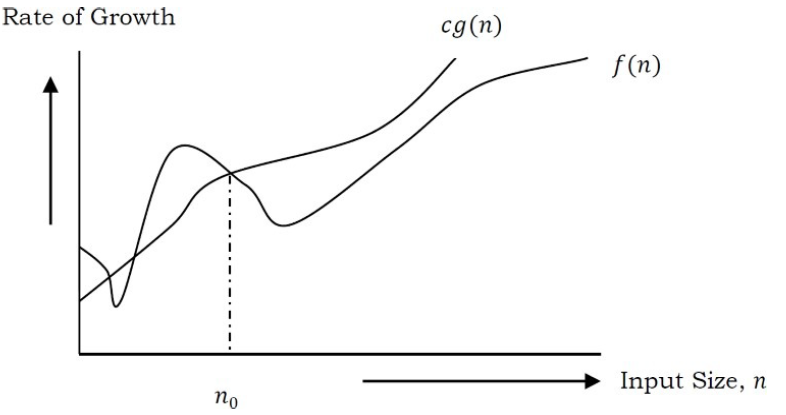
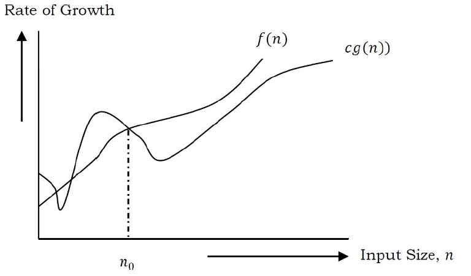
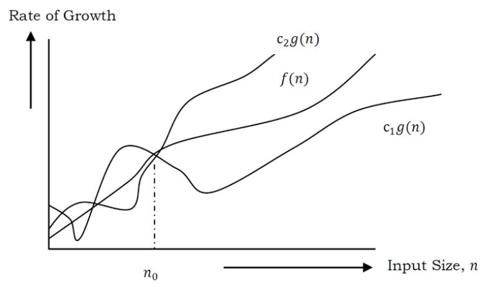

## Analysis of Algorithms

- To solve a specific problem p1, there might be many solutions possible. 
- Algorithm analysis helps to find efficient solution in terms of time and memory.
- Analysis of algorithms are expressed using Asymptotic notation. There are three types of asymptotic notations.
  - For which inputs algorithm takes the least amount of time to run (Best case)
  - For which inputs algorithm takes the longest amount of time to run (worst case)
  - For random inputs random running time of algorithm (Average case)
    - <b>Lower Bound <= Average Time <= Upper Bound </b>

## Asymptotic Notation
- Syntax for representing upper and lower bounds
- Upper and lower bounds need to be identified for best, worst and average cases
- "Asymptotic" means approaching a value or curve arbitrarily closely

### Big O Notation (upper bound function)
  - If f(n) denotes the running time(time complexity) of an algorithm , then O(g(n)) = f(n), there exists positive constants c and n0 such that 0 <= f(n) <= cg(n), for all n >= n0.
  - <i> Example </i>  

	  f(n) = 3n + 2  
	  3n + 2 <= cn (This condition will be satisfied if c >= 4, we choose 4 because that is closest)  
	  3n + 2 <= 4n  
	  n >= 2

  - Constant c is 4 and n0 is 2, which implies function 4n is always greater than 3n+2 when n >= 2.
  - <i>Conclusion</i> f(n) is always lessthan some constant multiplied by g(n), which describes upper bound of f(n).

### Big Omega  Notation Ω(lower bound function)
  - If f(n) denotes the time complexity of an algorithm, then Ω(g(n)) = f(n), there exists positive constants c and n0 such that 0 <= cg(n) <= f(n), for all n >= n0.
  - At larger values of n, the tighter lower bound of f(n) is g(n). For example, if f(n) = 100n<sup>2</sup> + 10n + 50, 	g(n) is Ω(n<sup>2</sup>).
  - <i>Example</i>

	  f(n) = 3n+2  
	  3n + 2 >= cn (This condition will be satisfied if c = 3)  
	  3n + 2 >= 3n (This condition will be satisfied for all n values >= 1)
	  
  - If c=3 and n0 = 1, all the conditions are satisfied for Big omega. i.e. f(n) = Ω(g(n))
  - <i>Conclusion</i> f(n) is always greater than some constant multiplied by g(n), which describes lower bound of f(n).

### Big Theta Notation (Order Function) 
  - If f(n) denotes the time complexity of an algorithm, then θ(g(n)) = f(n), there exists positive constants c1,c2,n0 such that 0 <= c1g(n) <= f(n) <= c2g(n), for all n >= n0.
  - Big theta is combination of Big oh and omega, but the function should satisfy the condition n >= n0.
  - From the above examples for f(n) = 3n+2, n0=2 for Big oh where as n0=1 for Big omega.

	  ```c1*n <= 3n + 2 <= c2*n, for all n > n0    
	  Solution 1 :: keep n0 as 1,but make c2 = 5, c1=3  
	  solution 2 :: n0 = 2, c1=3 and c2=4```



<br>
<span style="display:inline-block;margin-right: 150px;" width="200px">Big Oh</span>&emsp;&emsp;&emsp;&emsp;&emsp;&emsp;&emsp;&emsp;
<span style="display:inline-block;margin-right: 150px;" width="200px">Big Omega</span>&emsp;&emsp;&emsp;&emsp;&emsp;&emsp;&emsp;&emsp;<span style="display:inline-block;" width="200px">Big Theta</span>

- <b><i>Note</b></i>
	- Big oh is used to find the worst case. In any scenario performance can't be worst than this for any value of n.
	- Big omega is used to find the best case. In any scenario performance can't be better than this for any value of n.
	- Big theta gives average case.
	- In practice Big omega is not very much useful. Big oh is used to find the worst case scenarios.

- <b><i>Example</i></b><br>
	- int[] array= {5,7,3,2,1,8,9};<br>
	- Finding an element from the array has best, worst and average cases possible.
	- For ex searching element 5, is found in the first attempt, which is the best case. It is represented as Ω(1)
	- For ex searching for element 9, requires scan of the entire array, which is the worst case. It is represented as O(n).
	- For average case it is θ(n/2), which is θ(n)
	
Time complexity Analysis
------------------------
There are two types of algorithms. They are iterative and recursive. Any function that is written using iterative algorithm can be written using recursive algorithm and vice versa. There is nothing like one is better than other. 

Time complexity for iterative functions is determined by the no of times an iteration is executed. Incase of recursive algorithm time complexity is calculated by recursive functions. If an algorithm has neither iteration nor recursive, time complexity such an algorithm is not dependent on input size n. It is constant.

Iterative algorithms examples
-----------------------------

Problem 1
---------
	int i=1;
	int s=1;
	while(s <= n){
		i++;
		s= s+i;
	}

To findout howmany times the while gets executed given n as input , let us observe the values of i and s for few iterations.

	i --> 1	 2	3	4	5	6 
	s --> 1  3	6	10	15	21 .... n

The value of s at kth iteration is sum of integers from 1 to k. i.e. at 2nd iteration s value is sum of 1,2 and 3rd iteration it is sum of 1,2,3. The value of s at kth iteration is k(k+1)/2.

Suppose if the condition s <= n, is met at kth iteration.i.e. 
	k(k+1)/2 <= n;
	(k^2+k)/2 <= n;
	k^2 <= n; (ignore lower order terms)
It means k is proportional to √n. 

Answer
------
The time complexity of the above problem is O(√n).

Problem 2
---------
	for(int i=1; i^2 < n;i++){}

Instead of writing i^2 < n, we can write i < √n .i.e. time complexity O(√n).

Note:In the above problem , The best , worst and average cases are same, so we can write θ(√n).
	
Answer
------
The time complexity of the above problem is θ(√n).

Problem 3
---------
	int i,j,k,n;
	for(int i=1; i<= n; i++){
		for(int j=1; j<=i; j++){
			for(int k=1; k<= 100; k++){
				System.out.println("k" + k);
			}
		}
	}

Time taken for innermost for loop is not dependent on input size n. It takes constant time.
Lets observe the values of i,j,k with input size n.

i -->	1	2	3	4	...n
j -->	1	2	3	4	...n
k -->	100	200	300	400	...n*100

Total time for executing n iterations is (100+200+300+400 ...+n*100) = 100n(n+1)/2.

Answer
------
The time complexity of the problem is O(n*n).

Problem 4
---------
	int i,j,k,n;
	for(int i=1; i<= n; i++){
		for(int j=1; j<=i*i; j++){
			for(int k=1; k<= n/2; k++){
				System.out.println("k" + k);
			}
		}
	}

Lets observe the values of i,j,k with input size n.

i -->	1	2		3		4		...n
j -->	1	4		9		16		...n
k -->	n/2	4n/2		9n/2		16n/26		...(n^2*n)/2

Total time complexity for an input size of n is 
	n/2 + 4n/2 + 9n/2 ....(n^2)*n/2 = n/2(1+2*2+3*3+ ...n*n) = (n/2)*(n)(n+1)(2n+1)/6

Answer
------	
The time complexity of the problem is O(n*n*n*n).i.e. n power 4.

Problem 5
---------
	for(int i=1;i<n;i=i*2){
		//logic
	}
L
lets observe i value for an input size n

i --> 1	 	2	 4	 8 		...n
	  2^0	2^1	 2^2 2^3	...2^k

If i takes k iterations to reach value of n, then 2^k = n. i.e. k = log2(n)

Answer:
-------
The time complexity of the problem is O(log2(n))

Note: if i value is incremented as i*3, then time complexity is log3(n). depending on the order of increase of i, base of the log function changes.

Problem 6
---------
	int i,j,k,n;
	for(int i=n/2; i<= n; i++){ //n/2 times
		for(int j=1; j<=n/2; j++){ // n/2 times
			for(int k=1; k<= n; k=k*2){ //logn times
				System.out.println("k" + k);
			}
		}
	}

The outer for loop executes from n/2 to n. i.e. n/2 times. The middle for loop executes from 1 to n/2. i.e. n/2 times. The innermost for loop executes log2(n). 

Total time complexity is : (n/2)(n/2)log2(n)

Answer:
-------
The time complexity of the problem is O(n*n*log2(n))

Problem 7
---------
	int i,j,k,n;
	for(int i=n/2; i<= n; i++){ //n/2 times
		for(int j=1; j<=n; j=2*j){ // log2(n) times
			for(int k=1; k<= n; k=k*2){ //log2(n) times
				System.out.println("k" + k);
			}
		}
	}

Total time complexity is : (n/2)(log2(n))(log2(n))

Answer:
-------
The time complexity of the problem is O(n(log2(n))(log2(n)))

Note: To achieve the log(n) complexity using for loop(or while loop) in reverse order it the code should be like this.
	
	for(int i=n; i>1 ; i=n/2){}
	
	while(n>1){
		n=n/2
	}

The above two loops also have time complexity of log2(n)

Problem 8
---------
	
	for(int i=1; i<= n; i++){ 
		for(int j=1; j<=n; j=j+i){ 
			
		}
	}

The inner loop depends on outer loop for increment. Lets unroll this.

i --> 1		2		3		...n
j --> n		n/2		n/3		...1

Note: Inner for loop increments with the value of i. It means every iteration of inner for loop executes n/i times.

Time complexity is n(1+1/2+1/3...+1/n) = nlogn

Answer:
-------
The time complexity of the problem is O(nlogn)

Problem 9
---------
	int n=2^2^k;
	for(int i=1; i<= n; i++){ 
		j=2;
		while(j<=n){
			j=j^2;
		}
	}

Outer for loop executes n times given an input size n. As n value depends on k, lets see how k value impacts while loop.

k --> 1			2			3				
n --> 4			16			256
j --> (2,4)		(2,4,16)	(2,4,16,256)	
Total n*2		n*3			n*4 

So, for a given k value Total no of iterations of while loop is (k+1). Outer for loop executes n times. so total time is n*(k+1).

To find the total time with the input size n, we need to convert k value to n. i.e. 
	n=2^2^k;
applying logarithm on both sides	
	logn = 2^k;
again applying logarithm,
	log(logn) = k;

Answer:
-------
The time complexity of the problem is O(nlog(logn))

Recursive algorithms analysis
-----------------------------
For recursive algorithms time complexity is calculated using recursive functions. There are multiple ways of solving recursive functions. 
1)Back substitution
2)recursion tree method
3)Masters theorm

We only discuss Back substitution. 

Back substitution
-----------------
For ex, we have an algorithm like this.
	
	public int calc(int n){
		if(n > 1){
			return calc(n-1);
		}else{
			return 1;
		}
	}
	
Lets say time taken for executing calc(n) is T(n). Then for if condition time taken will be constant. Time taken for executing calc(n-1) will be T(n-1). i.e.
	T(n) = 1 + T(n-1); // Constant can be represented as C or simply 1.
Now substitute T(n-1) in the equation gives,
	T(n-1) = 1 + T(n-2);
Now T(n) = 1 + 1 + T(n-2);
	T(n) = 2 + T(n-2);
After k iterations,
	T(n) = k + T(n-k);
As per the if condition, the equation is valid if n > 1. i.e. recusion stops when n=1; When n =1, T(n) = 1;	
if k becomes n-1 then n-k becomes 1. T(n) = (n-1) + T(n-(n-1))
	T(n) = n-1 + T(1);
	T(n) = n;

Example 2
---------
	T(n) = n + T(n-1) // assume n > 1 and T(1) = 1
Substitute n-1 for n, T(n-1) = (n-1) + T(n-2)
	T(n) = n + (n-1) + T(n-2)
This can be written as 
	T(n) = n + (n-1) + (n-2)+ ....+T(n-k)
As per the assumption,
	T(n) = n + (n-1) + (n-2)+ ....+1
	T(n) = n(n+1)/2;

Time complexity is O(n*n)
	
Space complexity
----------------	
Space complexity describes the amount of space an algorithm takes with respect to the input size. Sometimes we need to choose carefully between time and space complexities, because reducing time complexity may increase space complexity and vice versa.

Iterative algorithm
-------------------
Example
-------
	public void sort(int[] a){
		int size = a.length;
		for(int i=1; i<= size ; i++){
			//logic here
		}
	}

Space required to run the algorithm is for  size and i variable. It takes 2 variables. The space complexity is n+2. Because is n is input it is not considered. So, Space complexity is constant. i.e. O(1).

Example 2
---------
	public void sort(int[] a){
		int size = a.length;
		int[] b = new b[size];
		for(int i=1; i<= size ; i++){
			b[i] = a[i];
			//logic here
		}
	}
	
Space required here is for variables size, b and i. It means 1 + n + 1. i.e. n+2. Space complexity is O(n).

Example 3
---------
	public void sort(int[] a){
		int size = a.length;
		int[][] b = new b[size][size];
		for(int i=1; i<= size ; i++){
			for(int i=1; i<= size ; i++){
				b[i][j] = a[i];
				//logic here
			}	
		}
	}

Space required here is for variables size, b, i and j. It means 1 + n*n + 1 + 1. i.e. n*n+3. Space complexity is O(n^2).

Recursive algorithms
--------------------
Example
-------
	public int sort(int n){
		if(n > 1){
			sort(n-1);
			System.out.println(n);
		}
	}

Note: There are two types of recursion. Here sort() method is called at the begining of the method. Hence it is called head recursion. If sort() is called at the end then it is called tail recursion. If sort() is called in the middle it is called body recursion.

Recursion should stop using some condition. Here the condition is n > 1. This condition is called anchor condition or halting condition.

Space complexity of a recursive algorithm is calculated using method stack. For ex, The method sort() is called with n value 3. The method statck would be sort(3) --> sort(2) --> sort(1).

As there is no new variable used here, space complexity is not calculated using variables. It is calculated using stack size. For ex, imagine each method call takes a fixed space on the stack say k. so, For n value 3, The stack size is 3. It means order of n.

The space complexity of the above algorithm is O(n)

Example 2
---------
	public int sort(int n){
		if(n > 1){
			sort(n-1);
			System.out.println(n);
			sort(n-1);
		}
	}

Before finding Space complexity lets see the Time complexity first. Time complexity here is nothing but howmany times sort() method is executed. 

This program executes like a binary tree with left node gets executed first until the condition (n > 1) is satisfied. Then it prints the value of n, then right node is executed. Lets take n value of 2.

The tree would be like this. sort(2) --> sort(1) --> 2 --> sort(1)
o/p : 2 (sort(1) won't execute because of the exit condition n > 1)

No of times sort() method is called for n value of 2 is 3.

Lets see for n = 3;

The tree is sort(3) --> sort(2) --> sort(1) --> 2 --> sort(1) --> 3 --> sort(2) --> sort(1) --> 2 --> sort(1)

o/p: 232.

No of times sort() method is called for n value of 3 is 7.
No of times sort() method is called for n value of k is 2^k-1.

Space complexity is not the no of times a method is called, but howmany spaces occupied on method stack. It is evident that for n value 2, stack occupies 2 spaces. stack pops up when n value is 1 for left node and re uses the same when n value is 1 for right node. So, for n value of 2 , space complexity is 2. 

Conclusion: For the above problem , The space complexity is O(n).

Note: sort(2) called twice for sort(3) calculation and sor(1) is called 2 times for sor(2). Also, sort(1) called 4 times for sort(3). If the results are cached when they are called first time, the performace can be increased. This is also called dynamic programming.

Lets findout the time complexity. As we have already seen the no of times sort() method is called for a given input size 2, it is 2^n. which is nothing but time complexity. Anyway lets find that out using recursion method.

Lets say time taken for executing sort(n) is T(n). Then 
	T(n) = 2T(n-1) + 1;
	T(n-1) = 2T(n-2) + 1; //substitute this in above equation.
	T(n) = 2(2T(n-2)+1)+1;
		 = 2^2T(n-2) + 2 + 1;
	T(n) = 2^k(T(n-k)) + 2^(k-1) + 1;
Substitue k = n-1, to meet the anchor condition
	T(n) = 2^(n-1) + 2^(n-2) + ...+ 2^2+2^1;
	T(n) = 2^n;

Time complexity is O(2^n).

