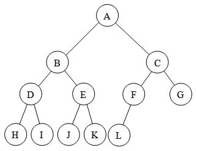

Trees
-----
A tree is a data structure similar to linked list but instead of each node pointing to the next node in a linear fashion, each node points to a number of nodes. Tree is an example of non-linear data structure. A tree structure is a way of representing hierarchical nature of a structure in graphical form.

Glossary
--------
i)The root of a tree is the node with no parents. 
ii)An edge refers to the link from parent to child. 
iii)A node with no children is called leaf node. 
iv)children of same parent are called siblings. 
v)A node p is an ancestor to q if there existing a path from root node to q via p. node q is called descendant of p. 
vi)size of a node is the number of descendants it has including itself. 
vii)set of all nodes at a given depth is called level of the tree. 
viii)The depth of a node is the length of the path from root to the node. 
ix)The height of a node is the length of the path from node to the deepest node. 
x)height of the tree is the maximum height among all the nodes in the tree. 

Note: 
If every node in the tree has only one child(except leaf nodes) then such trees are called as skew trees.

Binary Trees
------------
A tree is called binary tree if each node has 0,1 or 2 children max. Empty tree is also valid binary tree.

Types of binary trees:
----------------------
1)Strict binary tree: A tree is called strict binary tree if each node has exactly two children or no children. 
2)Full binary tree: If each node has exactly two children and all leaf nodes are at same level. 
3)Complete binary tree: A complete binary tree is a binary tree in which every level, except possibly the last, is completely filled, and all nodes are as far left as possible.
		

Properties of a Binary tree
---------------------------
i)In a Full binary tree no of elements at level 0 are 2^0, level 1 are 2^1 and at level h are 2^h. The no of nodes in a complete binary tree with height h are 2^0+2^1+2^2 ....2^h=2^(h+1)-1. 
ii)The no of nodes in a complete binary tree is between 2^h(minimum) and 2^(h+1)-1(maximum). 
iii)The no of leaf nodes in a full binary tree are 2^h. 
iv)The no of NULL links in a complete binary tree of n nodes are n+1. 

Operations on a Binary tree
---------------------------
Insertion, Deletion,Searching and Traversing.

Auxillary Operations
--------------------
Finding the size,height of the tree,Least common ancestor for a given pair of nodes etc..

Realtime usecases of Binary trees
---------------------------------
1)Expression trees used in compilers. 
2)Huffman coding trees used in data compression algorithms. 
3)BST(binary search tree), which supports search,insertion and deletion in O(logn) time. 
4)Priority Queues, which support search and deletion of min(or max) on a collection of items.

Binary Tree Traversals
----------------------
The process of visiting all nodes of a tree is called tree traversal. Each node is processed only once but they may be visited more than once. we have already seen that in linear data structures like linked lists elements are visited in sequential order, but in trees there are 3 different ways.

1)Preorder traversal(DLR): It means process current node data, process left subtree, process right subtree.  
2)Inorder traversal(LDR): left subtree,data,right subtree. 
3)Postorder traversal(LRD): left subtree,right subtree,data. 

Structure of a Binary tree in java is like this.

	class BinaryTreeNode<T> {
	
		private T data;
		private BinaryTreeNode<T> left;
		private BinaryTreeNode<T> right;
		
		BinartyTreeNode(T data){
			this.data = data;
			this.left = null;
			this.right = null;
		}
	}

Note: Setters and Getters are removed for readability.

Preorder Traversal
------------------

In preorder traversal each node is processed before either of the subtrees. It is defined as follows.	 
a)visit the root 
b)traverse the left subtree in preorder 
c)traverse the right subtree in preorder 

Recursive approach
------------------
	/**
	 *Time Complexity is O(n). Space complexity is O(n)/O(h).
	 */
	public void preorderTraversal(){
		if(root != null){
			System.out.print(root.getData() + "\t");
			preorderTraversal(root.getLeft());
			preorderTraversal(root.getRight());
		}
	}

Iterative approach
------------------
Even though each node is processed before the subtrees, it still requires to maintain information of the root to process the right subtree after left subtree. 
The obvious ADT to maintain information about root is stack.
	
	/**
	 *Time Complexity is O(n). Space complexity is O(n)/O(h).
	 */
	public void iterativePreorderTraversal(){
		Deque<Integer> stack = new ArrayDeque<Integer>();
		
		if(root!=null){
			stack.push(root);		
		}
		while(!stack.isEmpty()){
			BinaryTreeNode<T> temp=stack.pop();
			System.out.print(temp.getData() + "\t");
			//Note we push the right element first followed by left element
			//because pop will give left element first.
			if(temp.right != null){
				stack.push(temp.right);
			}
			if(temp.left != null){
				stack.push(temp.left);
			}
		}	
	}

Note: Inorder and Postorder tranversal are similar to Preorder. So, hence leaving for you to implement.

Level Order Traversal
---------------------
Level order traversal traverse elements from root by level. It can be implemented as follows. 
1)visit the root 
2)keep both the children in a queue. 
3)visit the first element in the queue, keep both the children of this in the queue at the end. 
4)repeat this until all levels are completed. 

	private void levelOrderTraversal(BinaryTreeNode<T> root){
		Deque<BinaryTreeNode<T>> queue=new ArrayDeque<>();
		if(root!=null){
			queue.offer(root);
			BinaryTreeNode<T> temp=null;
			while (!queue.isEmpty()) {
				/*remove the head element and assign it to temp*/
				temp = queue.poll();
				// process current node data and add its two children to the queue.
				System.out.print(temp.getData() + "\t");
				if (temp.getLeft() != null) {
					queue.offer(temp.getLeft());
				}
				if (temp.getRight() != null) {
					queue.offer(temp.getRight());
				}
			}
		}
	} 

Inserting an element
--------------------
In Binary Tree we can insert an element wherever we find a node with either left or right child is null.
	
	private void insert(BinaryTreeNode<T> root, T data) {
		Deque<BinaryTreeNode<T>> queue = new ArrayDeque<>();
		BinaryTreeNode<T> nodeToInsert = new BinaryTreeNode<>(data);
		if (root == null) {
			this.root = nodeToInsert;
		} else {
			queue.offer(root);
			BinaryTreeNode<T> temp = null;
			while (!queue.isEmpty()) {
				temp = queue.poll();
				if (temp.getLeft() == null) {
					temp.setLeft(nodeToInsert);
					queue.clear();
					break;
				} else {
					queue.offer(temp.getLeft());
				}

				if (temp.getRight() == null) {
					temp.setRight(nodeToInsert);
					queue.clear();
					break;
				} else {
					queue.offer(temp.getRight());
				}
			}
		}
	}

Finding the Size of a binary tree
---------------------------------
	
	/*Time complexity O(n) and Space complexity is O(n)*/
	public int size(BinaryTreeNode<T> root){
		if(root == null){
			return 0;
		}else{
			/* get the size of left node + add 1 for the current node + get the size of right node*/
			return size(root.getLeft())+1+size(root.getRight());
		}
	}

Reverse Level Order Traversal
-----------------------------
=======
Level order traversal traverse elements from root by level. It can be implemented as follows. 
1)visit the root 
2)keep both the children in a queue. 
3)visit the first element in the queue, keep both the children of this in the queue at the end. 
4)repeat this until all levels are completed.  

