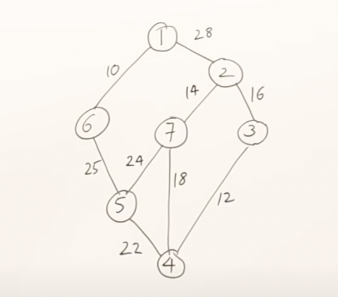

### Spanning tree

- Given a connected and undirected graph, a spanning tree of that graph is a subgraph that is a tree and connects all the vertices together. 
- A single graph can have different spanning trees.
- No of spanning trees for a given connected graph of n no of vertices is n.

- The above spanning tree is derived from a weighted graph. 

### Minimum cost spanning tree

- A minimum spanning tree (MST) or minimum weight(or cost) spanning tree for a weighted, connected and undirected graph is a spanning tree with weight less than or equal to the weight of every other spanning tree.
- The weight of a spanning tree is the sum of weights given to each edge of the spanning tree.
- There are two greedy algorithms to find minimum cost spanning tree.
  - Prim's
  - Kruskals

#### Prim's algorithm

- Let's consider the below example to explain prim's algorithm.
  
    

- Prim's algorithm